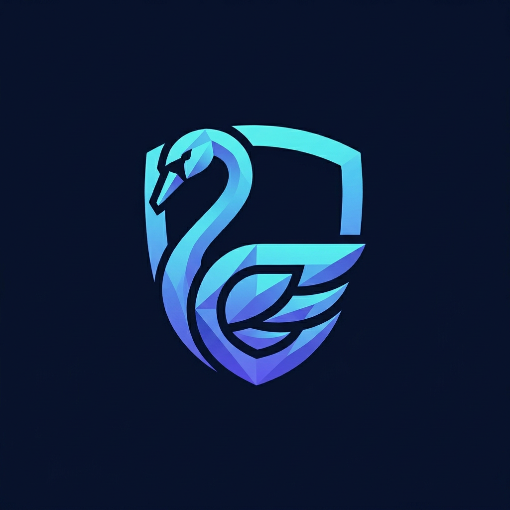

<p align="center"></p>
<h1 align="center">CYGNUS</h1>
<p align="center"><strong>Evidence-Based · Verification-Driven Bug Bounty Automation</strong></p>

> **Authorization comes first.** CYGNUS will not touch a target until the operator explicitly confirms permission, supplies an authorization reference, and the target matches a required allowlist. Use it only on assets you own, an in-scope bounty target, or systems for which you have written permission.

CYGNUS is an asset-aware security verification CLI. It fingerprints what actually answers, dynamically selects only relevant check plugins, discards candidates without captured evidence, computes confidence/severity centrally, and produces a traceable report. It does **not** emit a universal finding template or claim that a harmless reflection/version string is a confirmed exploit.

## Safety model

- Passive/detection-only by default. No guessed logins, uploads, writes, or exploit payloads.
- `--active` requires a distinct `--active-authorized` confirmation. The current built-in set remains detection-only; the gate exists for separately reviewed future active plugins.
- Every attempt—allowed or denied—is appended to `.cygnus/audit.jsonl` by default.
- `ONLINE` is selected only from runtime DNS/protocol reachability. Local files/directories and unreachable targets become `OFFLINE-STATIC`.
- Offline findings are tagged `STATIC/UNCONFIRMED` and excluded from confirmed severity totals.
- Captures are truncated and secret-pattern matches are redacted. Reports can still contain sensitive banners/content; handle them accordingly.

## Architecture

```text
operator / CLI
      │
      ▼
┌──────────────────────────────┐
│ authorization + scope + audit│  hard gate; runs before network access
└──────────────┬───────────────┘
               ▼
┌──────────┐  AssetProfile   ┌─────────────────────────────────────┐
│fingerprint├───────────────►│ plugin discovery + applicability gate│
│DNS/TCP/  │                 └──────────────┬──────────────────────┘
│TLS/HTTP/ │                                ▼
│file magic│                 ┌─────────────────────────────────────┐
└──────────┘                 │ web · network · cloud · containers  │
                             │ enterprise · supply-chain · IoT     │
                             └──────────────┬──────────────────────┘
                                            ▼
                             ┌─────────────────────────────────────┐
                             │ evidence validator + central scoring│
                             │ explicit chain dependency rules     │
                             └──────────────┬──────────────────────┘
                                            ▼
                                      Markdown / JSON report
```

A plugin is a class in `cygnus/modules/<category>/checks.py` exposing `name`, `applies_to`, `requires_active`, and async `run(profile, context)`. Discovery is automatic; adding a folder does not change the engine or report schema.

## Installation

CYGNUS requires **Python 3.11 or newer**. First, clone or download the repository and enter the project directory.

```bash
git clone https://github.com/ARENJKY369/BUGFINDER.git
cd BUGFINDER
```

### Linux / macOS

Create and activate a virtual environment:

```bash
python3 -m venv .venv
source .venv/bin/activate
```

### Windows PowerShell

```powershell
py -3.11 -m venv .venv
.venv\Scripts\Activate.ps1
```

Install the project and test dependencies:

```bash
python -m pip install --upgrade pip
pip install -e '.[test]'
```

Verify the installation:

```bash
cygnus --help
pytest
```

`pip install -e '.[test]'` installs CYGNUS in editable mode and makes the `cygnus` terminal command available. When returning to the project, you do not need to reinstall the dependencies; simply reactivate `.venv`.

## Authorization and scope setup

> Run CYGNUS only against an asset you own, an in-scope bug-bounty target, or a target for which you have written permission. Every scan requires an authorization reference and a scope allowlist.

Create `scope.txt` in the project directory and place one authorized asset on each line. Blank lines and `#` comments are ignored. Exact domains, wildcard subdomains, IP addresses, CIDRs, and local repository paths are supported.

```text
# scope.txt
example.com
*.staging.example.com
192.0.2.0/24
/home/operator/authorized-repo
```

The target host must match an entry in the scope file. For example, scanning `https://api.example.com` requires either `api.example.com` or a matching wildcard entry in scope.

## Basic command structure

```bash
cygnus TARGET \
  --scope scope.txt \
  --authorized \
  --authorization-ref 'YOUR-PERMISSION-REFERENCE'
```

You can also run the same CLI as a Python module:

```bash
python -m cygnus.cli.main TARGET \
  --scope scope.txt \
  --authorized \
  --authorization-ref 'YOUR-PERMISSION-REFERENCE'
```

The installed `cygnus` command is the recommended and shorter form.

## Usage examples

### Full asset-aware passive scan

CYGNUS fingerprints the target first, then runs only the modules applicable to the detected asset types. Manual `-m` module selection is not required.

```bash
cygnus https://example.com \
  --scope scope.txt \
  --authorized \
  --authorization-ref 'H1-PROGRAM-2026'
```

### API target scan

After adding the API to the scope file, pass it as a normal target. REST, GraphQL, API-documentation, authentication, and web checks are automatically selected or skipped according to fingerprint evidence.

```bash
cygnus https://api.example.com \
  --scope scope.txt \
  --authorized \
  --authorization-ref 'H1-API-SCOPE-2026' \
  --output api-report.md
```

### Domain or reconnaissance-oriented passive scan

The current CLI does not have a separate `-m recon` switch. The default scan is already passive and detection-only, and begins with DNS, TCP/banner, TLS, HTTP, and asset fingerprinting.

```bash
cygnus example.com \
  --scope scope.txt \
  --authorized \
  --authorization-ref 'RECON-AUTH-2026' \
  --timeout 5
```

### Save a Markdown report

Markdown is the default report format:

```bash
cygnus https://example.com \
  --scope scope.txt \
  --authorized \
  --authorization-ref 'TICKET-1001' \
  --format markdown \
  --output report.md
```

### Save a JSON report

```bash
cygnus https://example.com \
  --scope scope.txt \
  --authorized \
  --authorization-ref 'TICKET-1001' \
  --format json \
  --output report.json
```

The current version supports Markdown and JSON. `--format html` and `--depth aggressive` are not implemented options, so this README does not advertise them as supported commands.

### Offline/local repository scan

Add the authorized local repository path to `scope.txt`, then pass the same path as both the target and `--repository-path`:

```bash
cygnus /home/operator/authorized-repo \
  --scope scope.txt \
  --authorized \
  --authorization-ref 'INTERNAL-42' \
  --repository-path /home/operator/authorized-repo \
  --output repository-report.md
```

Local source findings appear in the `STATIC/UNCONFIRMED` section and are excluded from confirmed severity totals.

### Explicit active-mode authorization

Checks are passive by default. Enabling active modules requires a separate active confirmation in addition to normal authorization:

```bash
cygnus https://example.com \
  --scope scope.txt \
  --authorized \
  --authorization-ref 'TICKET-1' \
  --active \
  --active-authorized \
  --active-authorization-ref 'TICKET-1-ACTIVE'
```

The scan is blocked if `--active` is provided without `--active-authorized`.

### Interactive authorization

In an interactive terminal, you may omit `--authorized` and `--authorization-ref`:

```bash
cygnus https://example.com --scope scope.txt
```

CYGNUS prints its banner and requests confirmation and a scope reference at the authorization gate. Use explicit flags in CI/CD or other non-interactive environments.

### View supported options and asset types

```bash
cygnus --help
```

The current CLI does not provide a `--list-assets` option. Supported asset types are defined by the `AssetType` enum in `cygnus/core/models.py`, and detection is automatic—the operator does not manually force an asset type.

## Important command differences

The following example flags are **not** part of the current CYGNUS CLI:

```text
-m api
-m recon
--depth aggressive
--format html
--list-assets
```

Their current equivalents are:

- **API scan:** Pass the API URL as a normal target; modules are selected automatically.
- **Recon:** The default passive scan begins with fingerprinting.
- **Aggressive mode:** This is intentionally unavailable; gated active checks use `--active` plus a second confirmation.
- **HTML report:** Generate Markdown or JSON and use a trusted external renderer.
- **Asset list:** Review the `AssetType` enum; types detected at runtime are shown in the report header.

## Implemented verification categories

- **Web/API:** browser headers, untrusted-origin CORS, harmless reflected marker, public admin/API-documentation indicator.
- **SSH/FTP/RDP/email/network:** protocol banner/config capture and exact product/version correlation against the local NVD-derived cache. FTP anonymous access is detected only when advertised; no login is submitted.
- **Cloud/storage:** unauthenticated object-list response detection. Authenticated policy checks use only future operator-provided credentials; CYGNUS never discovers credentials itself.
- **Kubernetes/Docker:** unauthenticated identity endpoint detection (`/version`, `/_ping`) only; no control-plane operation.
- **CMS/CRM/ERP:** published exact product/version match against the cache, routed to manual verification because backports can invalidate banner-only conclusions.
- **Git/CI/CD/package registries:** public interface classification plus redacted secret patterns in an explicitly operator-provided local repository.
- **IoT/network devices:** default-credential *indicators* only. No credentials are attempted.

The local cache at `cygnus/data/cve_cache.json` identifies its NIST NVD API source, per-CVE NVD links, and last-updated date. It is intentionally small, so a cache miss means “not matched,” never “not vulnerable.”

## Report semantics

Confirmed counts contain only live, evidence-backed results that pass confidence rules. Weak indicators, harmless reflection, public-interface exposure, and version/CVE correlations are shown under **Needs Manual Verification**. Exploit chains are emitted only when every tag in a predefined dependency rule belongs to a confirmed finding.

## Tests

The integration suite starts local vulnerable and secure HTTP, FTP, and Kubernetes-dashboard mocks. It asserts classification, explicit plugin skips, finding disappearance after secure reconfiguration, report differences, and a regression signature preventing the historical static-output failure.

## Finding output invariants

Each finding includes a stable evidence ID, detected asset type, computed severity/confidence, timezone-aware UTC `observed_at`, exact component, captured evidence, root cause, exploitation vector, remediation, status, and optional locally cited CVE metadata. A final fail-closed pass removes findings with empty evidence, invalid timestamps/status, or asset tags not present in the fingerprint profile before severity totals or exploit chains are generated.

Applicable check plugins are independent async functions and execute concurrently. Inapplicable plugins remain explicit `skipped` ledger entries; protocol failures are isolated as `error` entries rather than converted into findings.

See [`AUDIT_REPORT.md`](AUDIT_REPORT.md) for the hardcoded-output audit and the live verification replacement map.
