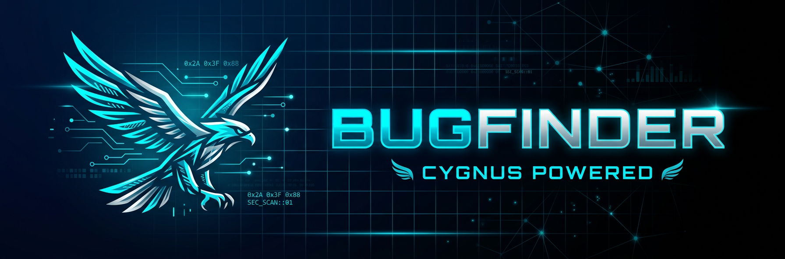

<p align="center">
  
</p>

<div align="center">


**Autonomous Evidence-Based Bug Bounty Hunting Framework**

</div>

---

## 🔍 What is BUGFINDER?

**BUGFINDER** is a next-generation autonomous bug bounty hunting framework powered by **CYGNUS** — an expert-level AI agent system designed to perform comprehensive security assessments with evidence-based findings.

Unlike traditional scanners, CYGNUS operates as a full **Assessment System** combining:
- 🕵️ **Asset Fingerprinting** — Intelligent target classification
- ✅ **Verification Engine** — Real request/response validation
- 📚 **Knowledge Base** — CVE and vulnerability intelligence
- 📋 **Report Writer** — Professional security reports

---

## 🚀 Features

| Feature | Description |
|---------|-------------|
| **Multi-Asset Support** | Web apps, APIs, cloud assets, containers, IoT devices, networks |
| **Evidence-Based Findings** | Every finding backed by captured requests/responses |
| **No False Positives** | Silent skipping of inapplicable checks |
| **Exploit Chain Analysis** | Rule-based dependency mapping between findings |
| **Dual Mode Operation** | Online (live testing) or Offline (static analysis) |
| **Professional Reporting** | Structured output with severity and confidence scores |

---

## ⚙️ Operating Modes

### 🌐 ONLINE MODE
Live network access with real HTTP/TCP/DNS requests. Every finding requires actual captured evidence.

### 📁 OFFLINE/STATIC MODE  
Source code and configuration analysis only. Findings labeled `[STATIC / UNCONFIRMED]` for manual verification.

---

## 🎯 Asset Types Supported

```
Web Applications     │   APIs (REST/GraphQL)      │   Mobile Apps
─────────────────────────────────────────────────────────────────────
Domains & Subdomains │   Cloud Storage Buckets     │   Kubernetes
─────────────────────────────────────────────────────────────────────
Docker Containers    │   CI/CD Pipelines           │   Git Repositories
─────────────────────────────────────────────────────────────────────
Network Services     │   IoT Devices               │   CMS/CRM Platforms
─────────────────────────────────────────────────────────────────────
OAuth/SSO Systems    │   Payment Systems           │   And 50+ more...
```

---

## 📊 Assessment Workflow

```
┌─────────────────────────────────────────────────────────────────┐
│  1. AUTHORIZATION GATE                                          │
│     └─ Confirm scope & operator authorization                   │
├─────────────────────────────────────────────────────────────────┤
│  2. MODE DECLARATION                                            │
│     └─ ONLINE or OFFLINE/STATIC                                 │
├─────────────────────────────────────────────────────────────────┤
│  3. ASSET DETECTION                                             │
│     └─ Fingerprint target classification                        │
├─────────────────────────────────────────────────────────────────┤
│  4. MODULE SELECTION                                            │
│     └─ Load only relevant per-asset-type checks                  │
├─────────────────────────────────────────────────────────────────┤
│  5. VERIFICATION PASS                                           │
│     └─ Run checks with captured evidence                         │
├─────────────────────────────────────────────────────────────────┤
│  6. CONFIDENCE/SEVERITY COUPLING                                │
│     └─ Apply evidence quality caps                              │
├─────────────────────────────────────────────────────────────────┤
│  7. CHAIN ANALYSIS                                              │
│     └─ Build rule-based exploit chains                          │
├─────────────────────────────────────────────────────────────────┤
│  8. REPORT GENERATION                                           │
│     └─ Structured output with all findings                      │
└─────────────────────────────────────────────────────────────────┘
```

---

## 📝 Output Format

Every scan produces a structured report:

```markdown
### 🛠️ SCAN STATUS REPORT
- Mode: [ONLINE / OFFLINE-STATIC]
- Target(s): [...]
- Detected asset type(s): [...]
- Authorization confirmed: [Yes/No]
- Modules loaded: [...]
- Checks run: [count] | Checks skipped: [count]

### 🚨 CONFIRMED FINDINGS (evidence-backed only)
**Finding N: [Name]**
- Asset type: [...]
- Severity: [Critical/High/Medium/Low] | Confidence: [High/Medium/Low]
- Component: [specific endpoint/service/file]
- Evidence: [actual captured response — required]
- Root Cause: [...]
- Exploitation Vector: [step-by-step]
- Remediation: [specific fix]

### 🟡 NEEDS MANUAL VERIFICATION
[Low confidence findings for manual review]

### 🔗 EXPLOIT CHAINS
[Rule-based chains between confirmed findings]

### 🧠 BOTTLENECK ANALYSIS & NEXT STEPS
[Strategic guidance based on findings]
```

---

## 🛡️ Core Principles

### 1. Never Fabricate Evidence
> *"A finding without evidence is not a finding — it's a guess."*

### 2. Zero Tolerance for Template Reuse
> *If the same finding template appears for different targets, treat it as a bug.*

### 3. Confidence ≠ Severity
> Weak evidence = Low confidence + Medium severity cap

### 4. Exploit Chains Require Proof
> Chains only built from findings with explicit, documented dependencies.

---

## 📂 Repository Structure

```
BUGFINDER/
├── README.md                 # This file
├── CYGNUS_SYSTEM_PROMPT.md   # Full CYGNUS agent instructions
├── assets/
│   ├── cygnus_logo_v2.png    # Primary logo (dark theme)
│   ├── cygnus_banner.png     # GitHub banner
│   └── shield_icon.png       # Security shield icon
└── .git/                     # Git repository
```

---

## 🎨 Brand Assets

All brand assets are located in the `/assets` directory:

| Asset | Usage |
|-------|-------|
| `cygnus_logo_v2.png` | Primary logo for light backgrounds |
| `cygnus_banner.png` | GitHub repository banner |
| `shield_icon.png` | Badges and small graphics |

---

## 📜 License

MIT License — See LICENSE file for details.

---

## 🤝 Contributing

Contributions welcome! Please ensure:
1. All findings have evidence fields
2. New asset types follow the module pattern
3. Reports maintain the required output format

---

<div align="center">

**Built with precision. Powered by CYGNUS.**

*BUGFINDER — Evidence-Based Security Assessment*

</div>